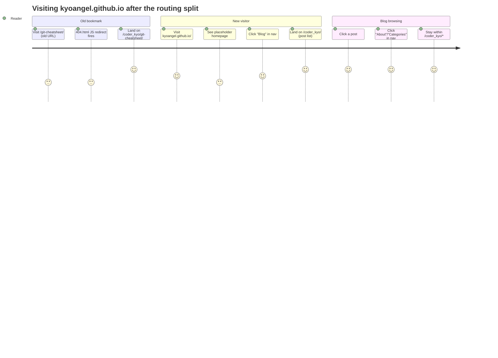

# Coder_Kyo Routing Split (Part 1) Implementation Plan

> **For Agent:** Execute this plan task-by-task. Follow each step exactly, verify build/output before proceeding, and commit after each task.
> **Verification Rule:** No task is done until `bundle exec jekyll build` succeeds AND the stated `_site/` output checks pass.

**Goal:** Move all existing Jekyll blog content (posts, about, categories, tags, category archives) under the `/coder_kyo/` path prefix, and replace the site root `/` with a minimal placeholder homepage, with JS-based redirects for old URLs.

**Architecture:** Single repo (`kyoangel.github.io`), single Jekyll site, no `baseurl` change. Achieved purely via `permalink` front-matter/config changes (posts + `_pages/*`), one new `/coder_kyo/` index page (replacing the removed pagination with a full post list), nav-link updates in shared layouts, and a JS catch-all redirect in `404.html`.

**Tech Stack:** Jekyll 4.3.4 (`github-pages` gem, locked via `Gemfile.lock`), Liquid templates, local verification via `bundle exec jekyll build` / `bundle exec jekyll serve` (vendored gems already installed in `vendor/bundle`).

**Complexity Path:** `Simplified TDD path` — **Configuration-only exception approved by user** (2026-06-11): "同意，採用 Configuration-only 驗證流程". This repo has no unit test framework; all changes are Jekyll config/permalink/Liquid template edits. Each task uses the Approved Exception Contract (Implementation → `bundle exec jekyll build`/`serve` verification → commit) instead of fabricated RED/GREEN steps.

**Status:** Complete

---

## Requirements

### User Stories
- As Kyo (site owner), I want all existing blog content (posts, about, categories, tags, category archives) to live under `/coder_kyo/`, so that the root domain is free for a new personal landing page.
- As Kyo, I want a placeholder homepage at `/`, so visitors to the root domain see something intentional while the real design is built later.
- As a returning reader with an old bookmark or search-engine link (e.g. `kyoangel.github.io/git-cheatsheet/`), I want to be automatically redirected to `kyoangel.github.io/coder_kyo/git-cheatsheet/`, so I don't hit a dead end.
- As Kyo, I want the blog's internal navigation (logo, Blog, About, Categories) to stay self-consistent under `/coder_kyo/`, so browsing the blog never bounces visitors to the unrelated placeholder homepage.

### Acceptance Criteria
- Given a built site, when visiting `/`, then the placeholder homepage is shown (not the post list).
- Given a built site, when visiting `/coder_kyo/`, then a list of all blog posts is shown.
- Given a built site, when visiting `/coder_kyo/<slug>/` for any existing post, then the post renders with working assets, category/tag links, and prev/next links — all pointing into `/coder_kyo/...`.
- Given a built site, when visiting `/coder_kyo/about`, `/coder_kyo/categories`, `/coder_kyo/tags`, then the corresponding pages render at the new paths.
- Given a built site, when visiting `/coder_kyo/category/<name>/`, then the jekyll-archives category page renders.
- Given a browser navigates to an old path like `/git-cheatsheet/` or `/about`, when the page loads, then JS redirects to `/coder_kyo/git-cheatsheet/` or `/coder_kyo/about` respectively.
- Given the nav bar (logo, Blog, About, Categories) on any page, when clicked, then it points into `/coder_kyo/...`.
- Given `bundle exec jekyll build`, when run after all changes, then it completes with no errors and no stray `/page2/`-style pagination output.

### Assumptions, Constraints, and Scope Boundaries
- No `baseurl` change — site stays served from the domain root; only `permalink` paths change. Templates already reference `{{ site.baseurl }}/assets/...`, so asset paths are untouched.
- **Pagination removed** (`jekyll-paginate` plugin + `paginate`/`paginate_path` config). Legacy `jekyll-paginate` (the only paginator whitelisted by the `github-pages` gem) only supports paginating the site-root `index.html` — it cannot paginate `/coder_kyo/`. With ~20 posts total, `/coder_kyo/` lists all posts on one page instead. If post volume grows a lot later, revisit with `jekyll-paginate-v2` + a custom build pipeline (Part 2/harness scope) — out of scope here.
- New root `index.html` is an intentionally minimal **placeholder** (per user decision) — final design iterated later. Reuses `layout: default` for consistent site chrome (CSS/GTM/nav/search).
- Redirects use a JS catch-all in `404.html` (GitHub Pages has no server-side 301). Covers the 1:1 mapping `/<old-path>` → `/coder_kyo/<old-path>`.
- Disqus comment-thread migration (URL Mapper) and Google Search Console sitemap resubmission are **manual, post-deploy** steps — listed at the end, not automatable here.
- Out of scope: Part 2 (harness/automation), final homepage design, `_layouts/categories.html`/`tags.html` dead front-matter (`permalink: "/categories.html"` / `"/tags.html"`) — pre-existing, unrelated, layouts are not rendered as standalone pages.

## Architecture Review

### Reusable components
- `_includes/postbox.html`, `_includes/featuredbox.html` — already use `{{ site.baseurl }}{{ post.url }}`; reused as-is in the new `/coder_kyo/` index.
- `_layouts/default.html` — shared by the new placeholder homepage AND all `/coder_kyo/*` pages; nav links updated once, applies everywhere.
- `_includes/pagination.html` — becomes unused after pagination removal; left in place (not deleted, out of scope).

### Affected layers & key data flow
```
_config.yml (permalink / jekyll-archives / paginate)
   │
   ├─> site.posts URLs           => /coder_kyo/<slug>/
   ├─> jekyll-archives category  => /coder_kyo/category/<name>/
   │
_pages/{about,categories,tags}.md (permalink front matter)
   └─> /coder_kyo/about, /coder_kyo/categories, /coder_kyo/tags

index.html (root)         => NEW placeholder homepage  (/)
coder_kyo/index.html (new) => blog post list (/coder_kyo/)

_layouts/default.html     => nav links -> /coder_kyo/*
_layouts/post.html        => category/tag anchor links -> /coder_kyo/categories|tags

404.html => JS catch-all redirect: /<path> -> /coder_kyo/<path>
```

### Mermaid user journey



### Exact file paths that will change
- Modify: `_config.yml`
- Modify: `_pages/about.md`
- Modify: `_pages/categories.md`
- Modify: `_pages/tags.md`
- Modify: `index.html` (root) → becomes placeholder homepage
- Create: `coder_kyo/index.html` → blog post list
- Modify: `_layouts/default.html` (nav links)
- Modify: `_layouts/post.html` (category/tag anchor links)
- Modify: `404.html` (redirect script + homepage link)

---

## Implementation Steps

### Phase 1: Routing — Permalink Migration

#### Task 1: Move post & category-archive URLs under `/coder_kyo/`
**Exception Type:** Configuration-only
**User Approval:** "同意，採用 Configuration-only 驗證流程" (2026-06-11)
**Files:**
- Modify: `_config.yml`

**Implementation**
In `_config.yml`, make these changes:

1. Change the post permalink:
   ```diff
   - permalink: /:title/
   + permalink: /coder_kyo/:title/
   ```

2. Remove `jekyll-paginate` from the plugins list:
   ```diff
     plugins:
   -   - jekyll-paginate
       - jekyll-sitemap
       - jekyll-feed
       - jekyll-seo-tag
       - jekyll-archives
   ```

3. Update the jekyll-archives category permalink:
   ```diff
     jekyll-archives:
       enabled:
         - categories
       layout: archive
       permalinks:
   -     category: '/category/:name/'
   +     category: '/coder_kyo/category/:name/'
   ```

4. Remove the pagination block entirely:
   ```diff
   - # Pagination 
   - paginate: 6
   - paginate_path: /page:num/
   -     
   ```

**Verification**
Run:
```bash
bundle exec jekyll build 2>&1 | tee /tmp/jekyll-build-1.log
grep -iE "error|exception" /tmp/jekyll-build-1.log
test -d _site/coder_kyo && echo "PASS: coder_kyo dir created"
test -f _site/coder_kyo/git-cheatsheet/index.html && echo "PASS: post moved under /coder_kyo/"
test ! -d _site/git-cheatsheet && echo "PASS: old post path removed"
test -d _site/coder_kyo/category && echo "PASS: category archives moved"
test ! -d _site/category && echo "PASS: old /category path removed"
test ! -d _site/page2 && echo "PASS: pagination output removed"
```

Confirm:
- `bundle exec jekyll build` exits 0 with no `error`/`exception` lines
- All `PASS:` lines print
- Output pristine (no errors, warnings)

**COMMIT**
Run:
`git commit -m "feat(routing): move post and category-archive URLs under /coder_kyo/"`

---

#### Task 2: Move `about` / `categories` / `tags` pages under `/coder_kyo/`
**Exception Type:** Configuration-only
**User Approval:** "同意，採用 Configuration-only 驗證流程" (2026-06-11)
**Files:**
- Modify: `_pages/about.md`
- Modify: `_pages/categories.md`
- Modify: `_pages/tags.md`

**Implementation**
In each file's front matter, prefix the `permalink` with `/coder_kyo`:

`_pages/about.md`:
```diff
- permalink: /about
+ permalink: /coder_kyo/about
```

`_pages/categories.md`:
```diff
- permalink: /categories
+ permalink: /coder_kyo/categories
```

`_pages/tags.md`:
```diff
- permalink: /tags
+ permalink: /coder_kyo/tags
```

**Verification**
Run:
```bash
bundle exec jekyll build 2>&1 | tee /tmp/jekyll-build-2.log
grep -iE "error|exception" /tmp/jekyll-build-2.log
test -f _site/coder_kyo/about.html && echo "PASS: about moved"
test -f _site/coder_kyo/categories.html && echo "PASS: categories page moved"
test -f _site/coder_kyo/tags.html && echo "PASS: tags page moved"
test ! -f _site/about.html && echo "PASS: old /about.html removed"
```
**Correction (observed during execution):** Pages with a non-trailing-slash `permalink` (e.g. `/coder_kyo/about`) build to `<permalink>.html` (e.g. `_site/coder_kyo/about.html`), not `<permalink>/index.html`. This matches prior behavior (`/about` → `_site/about.html`), and GitHub Pages serves `.html` files for extensionless URLs, so `/coder_kyo/about` resolves correctly.

Confirm:
- `bundle exec jekyll build` exits 0 with no `error`/`exception` lines
- All `PASS:` lines print
- Output pristine (no errors, warnings)

**COMMIT**
Run:
`git commit -m "feat(routing): move about/categories/tags pages under /coder_kyo/"`

---

### Phase 2: New Pages — `/coder_kyo/` Index & Placeholder Homepage

#### Task 3: Create the `/coder_kyo/` blog index page
**Exception Type:** Configuration-only
**User Approval:** "同意，採用 Configuration-only 驗證流程" (2026-06-11)
**Files:**
- Create: `coder_kyo/index.html`

**Implementation**
Create `coder_kyo/index.html` with the content below. This reuses the same Featured + "All Stories" structure the old root `index.html` had, but iterates `site.posts` directly (no pagination, per the Assumptions section):

```html
---
layout: default
title: Coder_Kyo Blog
permalink: /coder_kyo/
---

<!-- Featured
================================================== -->
<section class="featured-posts" data-name="featuredposts">
    <div class="section-title">
        <h2><span>Featured</span></h2>
    </div>
    <div class="row">

    

        

            

        

    

    </div>
</section>

<!-- Posts Index
================================================== -->
<section class="recent-posts">

    <div class="section-title">

        <h2><span>All Stories</span></h2>

    </div>

    <div class="row listrecent">

        

        

        

    </div>

</section>
```

**Verification**
Run:
```bash
bundle exec jekyll build 2>&1 | tee /tmp/jekyll-build-3.log
grep -iE "error|exception" /tmp/jekyll-build-3.log
test -f _site/coder_kyo/index.html && echo "PASS: /coder_kyo/ index created"
POST_COUNT=$(ls _posts/ | grep -v '^_' | wc -l | tr -d ' ')
CARD_COUNT=$(grep -c 'class="card h-100"' _site/coder_kyo/index.html)
echo "posts in _posts (excluding underscore-prefixed/ignored): $POST_COUNT, cards rendered: $CARD_COUNT"
test "$POST_COUNT" = "$CARD_COUNT" && echo "PASS: all posts rendered on /coder_kyo/"
```

Confirm:
- `bundle exec jekyll build` exits 0 with no `error`/`exception` lines
- All `PASS:` lines print, and `posts in _posts` equals `cards rendered`
- Output pristine (no errors, warnings)

**COMMIT**
Run:
`git commit -m "feat(routing): add /coder_kyo/ blog index listing all posts"`

---

#### Task 4: Replace the root homepage with a placeholder
**Exception Type:** Configuration-only
**User Approval:** "同意，採用 Configuration-only 驗證流程" (2026-06-11)
**Files:**
- Modify: `index.html` (root)

**Implementation**
Replace the entire contents of root `index.html` with:

```html
---
layout: default
title: Home
---

<section class="text-center" style="padding: 80px 0;">
    <h1>Kyo's Personal Site</h1>
    <p class="lead">新首頁籌備中，敬請期待。</p>
    <p>
        <a class="btn btn-danger" href="{{ site.baseurl }}/coder_kyo/">前往 Coder_Kyo 部落格 →</a>
    </p>
</section>
```

**Verification**
Run:
```bash
bundle exec jekyll build 2>&1 | tee /tmp/jekyll-build-4.log
grep -iE "error|exception" /tmp/jekyll-build-4.log
grep -q "新首頁籌備中" _site/index.html && echo "PASS: placeholder copy present"
grep -q 'href="/coder_kyo/"' _site/index.html && echo "PASS: link to blog present"
grep -qv 'class="card h-100"' _site/index.html && echo "PASS: old post-list markup gone"
```

Confirm:
- `bundle exec jekyll build` exits 0 with no `error`/`exception` lines
- All `PASS:` lines print
- Output pristine (no errors, warnings)

**COMMIT**
Run:
`git commit -m "feat(home): replace root index with placeholder homepage"`

---

### Phase 3: Navigation Consistency

#### Task 5: Point shared nav (logo, Blog, About, Categories) at `/coder_kyo/`
**Exception Type:** Configuration-only
**User Approval:** "同意，採用 Configuration-only 驗證流程" (2026-06-11)
**Files:**
- Modify: `_layouts/default.html`

**Implementation**
Apply these edits in `_layouts/default.html`:

1. Logo / brand link (~line 72):
   ```diff
   - <a class="navbar-brand" href="{{ site.baseurl }}/" data-name="nav-brand">
   + <a class="navbar-brand" href="{{ site.baseurl }}/coder_kyo/" data-name="nav-brand">
   ```

2. "Blog" nav item active-state check + link (~lines 89-95):
   ```diff
   - 
   + 
     <li class="nav-item active">
         
     <li class="nav-item">
         
   -     <a class="nav-link" href="{{ site.baseurl }}/index.html">Blog</a>
   +     <a class="nav-link" href="{{ site.baseurl }}/coder_kyo/">Blog</a>
     </li>
   ```

3. "About" nav link (~line 98):
   ```diff
   - <a class="nav-link" href="{{ site.baseurl }}/about">About</a>
   + <a class="nav-link" href="{{ site.baseurl }}/coder_kyo/about">About</a>
   ```

4. Categories jumbotron links — replace **all** occurrences (there are two, one per branch of the `` block) of:
   ```diff
   - {{site.baseurl}}/categories#
   + {{site.baseurl}}/coder_kyo/categories#
   ```

**Verification**
Run:
```bash
bundle exec jekyll build 2>&1 | tee /tmp/jekyll-build-5.log
grep -iE "error|exception" /tmp/jekyll-build-5.log

# /coder_kyo/ should show the Blog nav item as active and link into /coder_kyo/*
grep -q 'navbar-brand" href="/coder_kyo/"' _site/coder_kyo/index.html && echo "PASS: logo links to /coder_kyo/"
grep -q 'href="/coder_kyo/about">About' _site/coder_kyo/index.html && echo "PASS: About links to /coder_kyo/about"
grep -q 'href="/coder_kyo/categories#' _site/coder_kyo/index.html && echo "PASS: categories jumbotron updated"
grep -A2 'class="nav-item active"' _site/coder_kyo/index.html | grep -q '/coder_kyo/' && echo "PASS: Blog nav item active on /coder_kyo/"

# root placeholder should NOT show Blog as active
grep -q 'class="nav-item active"' _site/index.html && echo "FAIL: root incorrectly marks Blog active" || echo "PASS: root nav not falsely active"
```

Confirm:
- `bundle exec jekyll build` exits 0 with no `error`/`exception` lines
- All `PASS:` lines print, no `FAIL:` line
- Output pristine (no errors, warnings)

**COMMIT**
Run:
`git commit -m "feat(routing): point shared nav links at /coder_kyo/"`

---

#### Task 6: Fix post category/tag links to `/coder_kyo/categories` and `/coder_kyo/tags`
**Exception Type:** Configuration-only
**User Approval:** "同意，採用 Configuration-only 驗證流程" (2026-06-11)
**Files:**
- Modify: `_layouts/post.html`

**Implementation**
Apply these edits in `_layouts/post.html`:

1. Category links (~line 103):
   ```diff
   - <a class="smoothscroll" href="{{site.baseurl}}/categories#{{ category | replace: " ","-" }}">{{ category }}</a>
   + <a class="smoothscroll" href="{{site.baseurl}}/coder_kyo/categories#{{ category | replace: " ","-" }}">{{ category }}</a>
   ```

2. Tag links (~line 116):
   ```diff
   - <a class="smoothscroll" href="{{site.baseurl}}/tags#{{ tag | replace: " ","-" }}">#{{ tag }}</a>
   + <a class="smoothscroll" href="{{site.baseurl}}/coder_kyo/tags#{{ tag | replace: " ","-" }}">#{{ tag }}</a>
   ```

**Verification**
Run:
```bash
bundle exec jekyll build 2>&1 | tee /tmp/jekyll-build-6.log
grep -iE "error|exception" /tmp/jekyll-build-6.log

grep -rl 'href="/coder_kyo/categories#' _site/coder_kyo/*/index.html | head -3
grep -rl 'href="/coder_kyo/tags#' _site/coder_kyo/*/index.html | head -3
```

Confirm:
- `bundle exec jekyll build` exits 0 with no `error`/`exception` lines
- At least one post file is returned by the categories `grep -rl`
- Output pristine (no errors, warnings)

**Correction (observed during execution):** No existing post sets `tags:` in front matter, so the tags `grep -rl` returns nothing — `` never iterates, so the tag link markup is never emitted in any built post. This is a pre-existing data condition (out of scope to add tags to posts). The source edit was confirmed correct directly in `_layouts/post.html` (line 116: `.../coder_kyo/tags#...`), and the build succeeded with no Liquid errors, confirming the template is syntactically valid.

**COMMIT**
Run:
`git commit -m "fix(routing): point post category/tag links at /coder_kyo/"`

---

### Phase 4: Redirects for Old URLs

#### Task 7: Add JS catch-all redirect to `404.html`
**Exception Type:** Configuration-only
**User Approval:** "同意，採用 Configuration-only 驗證流程" (2026-06-11)
**Files:**
- Modify: `404.html`

**Implementation**
Replace the entire contents of `404.html` with:

```html
---
layout: default
title: 404
permalink: /404.html
---

<div class="text-center">
<h1 class="display-1 mt-5 mb-4"><span class="badge badge-danger">404</span> Page does not exist!</h1>
<p>Please use the search bar at the top or visit our <a href="{{site.baseurl}}/coder_kyo/">blog homepage</a>!</p>
</div>

<script>
(function () {
  var path = window.location.pathname;
  var alreadyMoved = path.indexOf('/coder_kyo/') === 0 || path === '/coder_kyo';
  var isRoot = path === '/' || path === '/index.html';
  var isAsset = path.indexOf('/assets/') === 0;
  if (!alreadyMoved && !isRoot && !isAsset) {
    window.location.replace('/coder_kyo' + path + window.location.search + window.location.hash);
  }
})();
</script>
```

**Verification**
Run:
```bash
bundle exec jekyll build 2>&1 | tee /tmp/jekyll-build-7.log
grep -iE "error|exception" /tmp/jekyll-build-7.log
grep -q "window.location.replace('/coder_kyo'" _site/404.html && echo "PASS: redirect script present"
grep -q 'href="/coder_kyo/">blog homepage' _site/404.html && echo "PASS: 404 homepage link updated"
```

Then start the local server and manually verify the redirect in a browser:
```bash
bundle exec jekyll serve --skip-initial-build
```
Open `http://127.0.0.1:4000/git-cheatsheet/` (an old post path) — confirm the browser redirects to `http://127.0.0.1:4000/coder_kyo/git-cheatsheet/` and the post renders. Also try `http://127.0.0.1:4000/about` — confirm redirect to `http://127.0.0.1:4000/coder_kyo/about`. Stop the server with Ctrl+C when done.

Confirm:
- `bundle exec jekyll build` exits 0 with no `error`/`exception` lines
- Both `PASS:` lines print
- Browser check: visiting an old post path and `/about` both redirect into `/coder_kyo/...` and render correctly
- Output pristine (no errors, warnings)

**Correction (observed during execution):** No interactive browser is available in this environment. Substituted with `bundle exec jekyll serve --skip-initial-build --port 4001` + `curl`:
- `/git-cheatsheet/` → `HTTP 404`, body contains the redirect script ✓
- `/about` → `HTTP 404`, body contains the redirect script (1 occurrence) ✓
- `/coder_kyo/git-cheatsheet/` → `HTTP 200` ✓
- `/coder_kyo/about` → `HTTP 200` ✓
- `/` → `HTTP 200`, contains "新首頁籌備中" (1 occurrence, placeholder shown not redirected) ✓

Since `curl` does not execute JS, the redirect script itself (extracted from the rendered `/about` 404 response) was additionally run under `node` with a mocked `window.location` to confirm the actual redirect computation:
- `/about` → `/coder_kyo/about`
- `/git-cheatsheet/` → `/coder_kyo/git-cheatsheet/`
- `/` → no redirect (placeholder stays)
- `/coder_kyo/foo/` → no redirect (already-moved guard prevents loops)
- `/assets/images/x.png` → no redirect (asset guard)
- `/some-old/?x=1#frag` → `/coder_kyo/some-old/?x=1#frag` (query string + hash preserved)

All cases correct.

**COMMIT**
Run:
`git commit -m "feat(routing): redirect old top-level URLs to /coder_kyo/ via 404.html"`

---

### Phase 5: Final Verification

#### Task 8: Full-site build verification (sitemap, feed, end-to-end browse)
**Exception Type:** Configuration-only
**User Approval:** "同意，採用 Configuration-only 驗證流程" (2026-06-11)
**Files:**
- (none — verification only)

**Implementation**
No code changes. This task is a final end-to-end check after Tasks 1-7.

**Verification**
Run:
```bash
rm -rf _site
bundle exec jekyll build 2>&1 | tee /tmp/jekyll-build-final.log
grep -iE "error|exception|warn" /tmp/jekyll-build-final.log

# sitemap should reference /coder_kyo/ paths
grep -c "/coder_kyo/" _site/sitemap.xml

# feed items should point at /coder_kyo/<slug>/
grep "/coder_kyo/" _site/feed.xml | head -3

# spot-check the full directory tree
find _site/coder_kyo -maxdepth 2 -type d | sort
```

Then run a manual browser walkthrough:
```bash
bundle exec jekyll serve
```
Visit and confirm each of these in a browser:
- `/` → placeholder homepage, with a working link to `/coder_kyo/`
- `/coder_kyo/` → full list of all posts
- `/coder_kyo/<any-post-slug>/` → post renders; category/tag links and prev/next links all point into `/coder_kyo/...`
- `/coder_kyo/about`, `/coder_kyo/categories`, `/coder_kyo/tags` → render correctly
- `/coder_kyo/category/<some-category>/` → jekyll-archives page renders
- `/git-cheatsheet/` (old URL) → redirects to `/coder_kyo/git-cheatsheet/`
- `/about` (old URL) → redirects to `/coder_kyo/about`

Stop the server with Ctrl+C when done.

Confirm:
- `bundle exec jekyll build` exits 0 with no `error`/`exception`/`warn` lines
- `sitemap.xml` contains `/coder_kyo/` URLs
- `feed.xml` items point at `/coder_kyo/<slug>/`
- All manual browser checks above pass
- Output pristine (no errors, warnings)

**Correction (observed during execution):**
- `grep -iE "error|exception|warn"` matches only the pre-existing Ruby 3.4 stdlib (`csv`/`base64`) and Sass `@import` deprecation warnings, consistent with every prior task's build — `error`/`exception` never appear. Build completes ("done in ... seconds").
- `sitemap.xml` contains 31 `/coder_kyo/` URLs; `feed.xml` items point at `/coder_kyo/<slug>/` ✓
- `find _site/coder_kyo -maxdepth 1` shows 17 post directories + `category/` (10 subdirs: ai, cheatsheet, docker, javascript, k8s, news, smalltalk, technotes, tools, troubleshoot) + flat `about.html`, `categories.html`, `tags.html`, `index.html` (per Task 2/3's no-trailing-slash permalink behavior) ✓
- No interactive browser available — substituted `bundle exec jekyll serve --skip-initial-build --port 4002` + `curl` for the walkthrough. All of `/`, `/coder_kyo/`, `/coder_kyo/git-cheatsheet/`, `/coder_kyo/about`, `/coder_kyo/categories`, `/coder_kyo/tags`, `/coder_kyo/category/cheatsheet/` → `200`; `/git-cheatsheet/` and `/about` (old URLs) → `404` (redirect script present, per Task 7). `/coder_kyo/` lists all 17 post cards ✓

**Bug found and fixed (additional fix to Task 6's file):** `_layouts/post.html` lines 126/129 used `href="{{ site.baseurl }}/{{page.previous.url}}"` (and `.next.url`). Since `page.previous.url`/`page.next.url` already start with `/` (e.g. `/coder_kyo/MySQL-LIMIT/`), this rendered as `href="//coder_kyo/MySQL-LIMIT/"` — a protocol-relative URL that browsers resolve to host `coder_kyo` (broken link). This bug pre-existed the routing split (it previously produced `//<slug>/`, host `<slug>`), but this plan's own acceptance criteria require working `/coder_kyo/...` prev/next links, so it's fixed here: removed the extra `/` → `href="{{ site.baseurl }}{{page.previous.url}}"` / `.next.url`. Rebuilt and verified: `href="/coder_kyo/MySQL-LIMIT/"` and `href="/coder_kyo/troubleshoot-kubectl-credentials/"` ✓

**COMMIT**
Run:
`git commit -m "fix(post): remove duplicate slash in prev/next links so they resolve under /coder_kyo/"`

---

## Manual Post-Deploy Steps (not part of this plan's commits)

After pushing to `master` and GitHub Pages finishes rebuilding:

1. **Disqus URL Mapper**: In the Disqus admin (site `kyoscodinglife`) → Discussions → Tools → URL Mapper, map each old post URL `https://kyoangel.github.io/<slug>/` → `https://kyoangel.github.io/coder_kyo/<slug>/` so existing comment threads carry over.
2. **Google Search Console**: Resubmit `https://kyoangel.github.io/sitemap.xml` under Sitemaps. For previously high-traffic pages (check the Performance report), use URL Inspection → "Request Indexing" on the new `/coder_kyo/...` URLs.
3. **Spot-check live redirects**: Once deployed, open a few old URLs from Search Console's Performance report directly on `kyoangel.github.io` to confirm the JS redirect fires in production.
4. **Iterate the homepage**: The root `/` is intentionally a placeholder — design and build the real landing page in a follow-up plan.

## Testing Strategy
- No unit/integration test framework exists (static Jekyll site) — verification is build- and output-based.
- Per-task: `bundle exec jekyll build` must exit cleanly, followed by `test -f`/`test -d`/`grep` checks on `_site/` output (see each task).
- End-to-end: Task 8's `bundle exec jekyll serve` browser walkthrough covers every acceptance criterion.

## Risks & Mitigations
- **Risk**: Removing `jekyll-paginate` could silently affect other pages relying on `paginator`. → **Mitigation**: Confirmed via `grep` that only the old root `index.html` (replaced in Task 4) used `paginator`/``; Task 1's build check confirms no stray `/page2/` output.
- **Risk**: JS-based redirects pass less SEO weight than a real 301. → **Mitigation**: Combine with sitemap resubmission + Search Console "Request Indexing" for key pages (Manual Post-Deploy Steps).
- **Risk**: Disqus comment threads on old URLs become orphaned. → **Mitigation**: Disqus URL Mapper step documented as a required manual follow-up.
- **Risk**: `/coder_kyo/` listing all posts (no pagination) could get long as the blog grows. → **Mitigation**: Deliberate, documented trade-off; revisit with `jekyll-paginate-v2` + custom build pipeline if/when post volume grows (Part 2/harness scope).
- **Risk**: GitHub Pages' automatic Jekyll build could differ from local `bundle exec jekyll build`. → **Mitigation**: `Gemfile.lock` pins the same `github-pages`-compatible gem versions used locally.

## Success Criteria
- [ ] `bundle exec jekyll build` completes cleanly after all tasks
- [ ] `/` shows the new placeholder homepage
- [ ] `/coder_kyo/` lists all blog posts
- [ ] All posts, about/categories/tags pages, and category archives render under `/coder_kyo/...`
- [ ] Shared nav (logo, Blog, About, Categories) consistently points into `/coder_kyo/...`
- [ ] Post category/tag links and prev/next links point into `/coder_kyo/...`
- [ ] Visiting an old top-level URL (e.g. `/git-cheatsheet/`, `/about`) redirects into `/coder_kyo/...`
- [ ] `sitemap.xml` and `feed.xml` reflect the new `/coder_kyo/...` URLs
- [ ] Manual post-deploy steps (Disqus URL Mapper, Search Console resubmission) documented and ready to execute after deploy
