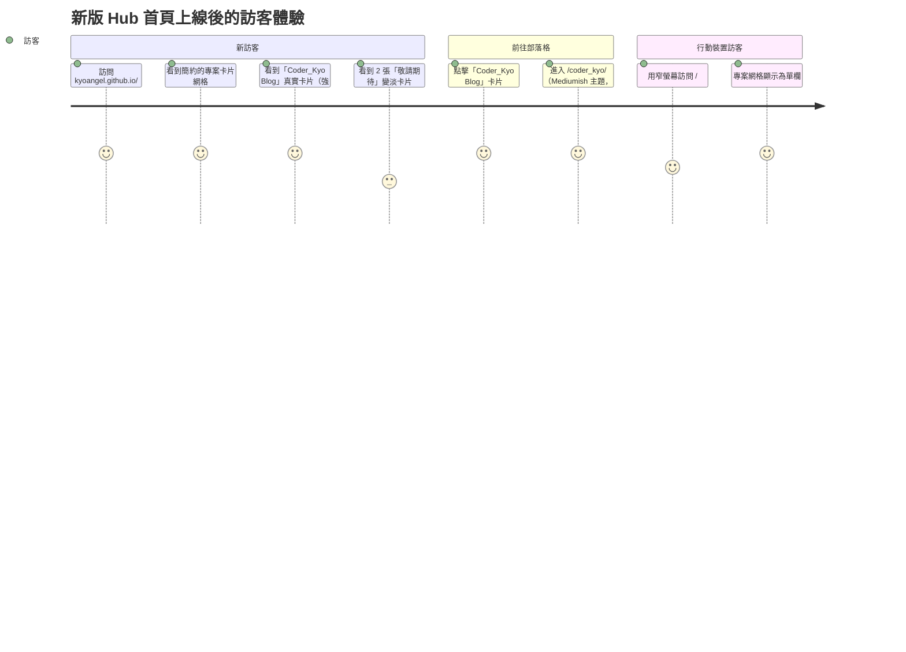

# 新首頁（多專案 Hub）實作計畫

> **給執行者：** 請逐個 Task 依序執行，每個 Task 都要先驗證 build/輸出，再進行下一步並 commit。
> **驗證規則：** 每個 Task 必須等 `bundle exec jekyll build` 成功，且該 Task 指定的 `_site/` 輸出檢查都通過，才算完成。

**目標：** 將網站根目錄 `/` 目前的暫時佔位頁面，換成全新、簡約風格的「專案 Hub」頁面 —— 以卡片網格列出 Kyo 的各個專案（目前只有 Coder_Kyo Blog → `/coder_kyo/`），並預留可擴充的「敬請期待」佔位卡片，視覺風格與 `/coder_kyo/...` 部落格目前使用的 Mediumish 主題完全不同。

**背景脈絡：** 這是上一個計畫 `docs/plans/2026-06-12-coder-kyo-routing-split.md`（Part 1，已完成並上線）中「之後再迭代首頁」這項待辦的後續設計與實作。`docs/research.md` 當時只記錄了「先放佔位頁面，之後再迭代」的決定，並沒有具體設計方向；本計畫就是這次的迭代。本次對談中，使用者確認的方向如下：
- 根目錄 `/` 將成為**多專案 Hub**（不是個人品牌/簡介頁）—— `/coder_kyo/` 只是其中一個專案，未來可以在同一個網域下擴充更多專案。
- **全新的簡約視覺設計**，刻意與部落格的 Mediumish 主題風格區隔（這個頁面不會用到 Bootstrap/jQuery/Mediumish CSS/JS）。
- 內容**純粹是專案卡片網格**，沒有個人簡介/標語/社群連結等區塊。
- 目前：**1 張真實卡片**（Coder_Kyo Blog → `/coder_kyo/`）**+ 2 張「敬請期待」佔位卡片**，資料來自新建的 `_data/projects.yml`，未來新增專案只需編輯這份 YAML 即可。

**架構：** 建立全新、獨立的「Hub」layout + 樣式表，只給根目錄 `index.html` 使用。`/coder_kyo/...` 與 `_layouts/default.html`（Mediumish 主題）完全不會被修改 —— 對部落格不會有任何回歸風險。

**技術棧：** Jekyll 4.3.4（`github-pages` gem，透過 `vendor/bundle`）、Liquid templates、純 CSS（不用 Sass，避免進到既有的 Mediumish `main.scss` 流程）、`_data/*.yml` 作為內容來源。

**複雜度路徑：** `Simplified path` —— **靜態網站驗證例外**（與 Part 1 相同的理由，2026-06-11 已核准：「同意，採用 Configuration-only 驗證流程」）。這個 repo 沒有單元測試/E2E 測試框架，所有變更都是 Jekyll templates/CSS/data 檔案。每個 Task 流程：實作 → `bundle exec jekyll build` + `_site/` 輸出檢查 → commit。因為這次涉及全新的視覺設計（不只是設定檔），**Task 5 額外包含一個人工視覺檢視步驟**：執行 `bundle exec jekyll serve`，由使用者在瀏覽器中檢視第一版設計並回饋，後續的 CSS 微調可作為小修正。

**狀態：** Complete

---

## 需求說明

### User Stories
- 作為 `kyoangel.github.io` 的訪客，我想看到一個清楚的 Hub，列出 Kyo 的各個專案，這樣我可以快速找到並前往我感興趣的專案。
- 作為 Kyo，我想讓 Hub 的視覺設計獨立、簡約，且與 Coder_Kyo 部落格的 Mediumish 主題不同，這樣根網域看起來像「個人專案索引」而不是部落格。
- 作為 Kyo，我想讓專案清單由資料檔（`_data/projects.yml`）驅動，這樣未來新增/移除/排序專案只要編輯一個檔案，不用改 HTML/CSS。
- 作為訪客，我想讓「敬請期待」的佔位卡片在視覺上明顯是不可互動的（變灰、無連結），這樣我不會誤點失效連結。

### Acceptance Criteria
- Given 已建置的網站，When 訪問 `/`，Then 顯示一個響應式的專案卡片網格（不再是舊的佔位文字/按鈕）。
- Given `_data/projects.yml` 中某個項目 `status: active`，When 渲染時，Then 該卡片可點擊，連結到該專案的 `url`，並以強調色樣式呈現。
- Given `_data/projects.yml` 中有 `status: placeholder` 的項目，When 渲染時，Then 顯示為不可點擊、視覺上變淡的卡片（無連結、透明度降低）。
- Given 新首頁，When 檢視頁面原始碼，Then 連結到新的樣式表 `assets/css/home.css`，而不是 `main.css`/`screen.css`/Bootstrap。
- Given 新首頁，When 在行動裝置寬度（≤600px）檢視，Then 專案網格會收合成單欄。
- Given `bundle exec jekyll build`，When 在所有變更完成後執行，Then 應成功完成且 `/coder_kyo/...` 的輸出與本計畫執行前相同，沒有變化。
- Given Part 1 加入的 404.html 重新導向腳本，When 訪問 `/`，Then 仍然不會觸發導向（其 `isRoot` 防護邏輯未被修改）。

### 假設、限制與範圍邊界
- Hub 上不放個人簡介/標語/社群連結區塊 —— 純專案卡片網格，依使用者決定。
- 目前共 3 張卡片（1 真實 + 2 個「敬請期待」），放在 `_data/projects.yml`。未來新增第 4 個專案只需新增一筆 YAML 項目；網格樣式（`repeat(auto-fit, minmax(...))`）會自動重新排列。
- 新的 `_layouts/home.html` 會保留 ``（jekyll-seo-tag，已是站台 plugin）與 `site.favicon`，維持 SEO/品牌一致性；同時保留核心 Google Tag Manager 腳本（同一個 GTM ID：`GTM-WH86SDR`）以維持分析追蹤的一致性 —— 但不包含 Bootstrap CDN、jQuery、Mediumish JS/CSS、navbar/footer/jumbotron，以及（看起來已經停用的、Google Optimize 時代的）anti-flicker 腳本。`<title>` + `` 的寫法與 `_layouts/default.html` 一致，維持站內慣例。
- 使用純 CSS 檔案（`assets/css/home.css`），不用 Sass —— 與既有 Mediumish 的 `main.scss` 流程隔離，作為靜態資源直接複製到 `_site/assets/css/home.css`。
- `_layouts/default.html`、`/coder_kyo/...` 與所有 Mediumish 資源/樣板，本計畫**不會**修改。
- 不需要修改 `_config.yml` —— `_data/*.yml` 與新的 layouts/assets 會被 Jekyll 自動偵測。
- 這是設計的第一版迭代。本計畫提出的配色/間距/字體是乾淨、現代的簡約基準（系統字型、中性背景、單一強調色、卡片網格 + hover 懸浮效果）。最後一個 Task 包含人工瀏覽器檢視步驟，供後續微調。
- 範圍之外：未來專案的實際內容（目前只有 2 張「敬請期待」佔位卡片）、新頁面的 GTM 事件追蹤（`autoAddGtag`）、Part 2 harness 自動化。

## 架構檢視

### 可重用元件
- ``（jekyll-seo-tag）—— 已是站台 plugin，可在任何 layout 使用；直接沿用。
- `site.favicon`、`site.name`、`site.time` 設定值 —— 沿用於 favicon/頁尾版權年份。
- `_layouts/default.html` 中的 GTM 腳本片段 —— 只沿用核心追蹤片段，維持分析資料的連續性。

### 受影響的層級與資料流
```
_data/projects.yml（新建）
  - title, description, url, status (active | placeholder)
       │
       ▼
index.html（根目錄，重寫）
  layout: home
   → 渲染 .project-card
       │
       ▼
_layouts/home.html（新建）
  簡約 <head>（favicon、、GTM、home.css）
  {{ content }} + 簡約頁尾
       │
       ▼
assets/css/home.css（新建）
  .hub, .project-grid, .project-card（+ --active / --placeholder）、響應式 @media

不受影響：
_layouts/default.html、/coder_kyo/*、main.scss、screen.css、mediumish.js、404.html
```

### Mermaid 使用者旅程圖



### 會變更的檔案路徑
- 新建：`_data/projects.yml`
- 新建：`_layouts/home.html`
- 新建：`assets/css/home.css`
- 修改：`index.html`（根目錄）—— 將佔位內容換成專案卡片 Hub

---

## 實作步驟

### Phase 1：內容資料

#### Task 1：新建 `_data/projects.yml`
**例外類型：** 靜態網站驗證（無測試框架）
**使用者核准：** 與 Part 1 相同理由（2026-06-11 Configuration-only 例外）
**檔案：**
- 新建：`_data/projects.yml`

**實作內容**
建立 `_data/projects.yml`：
```yaml
- title: "Coder_Kyo Blog"
  description: "分享程式開發技巧、學習筆記與技術心得"
  url: /coder_kyo/
  status: active

- title: "Coming Soon"
  description: "新專案籌備中，敬請期待"
  url: ""
  status: placeholder

- title: "Coming Soon"
  description: "新專案籌備中，敬請期待"
  url: ""
  status: placeholder
```

**驗證**
執行：
```bash
bundle exec jekyll build 2>&1 | tee /tmp/jekyll-build-home-1.log
grep -iE "error|exception" /tmp/jekyll-build-home-1.log
```

確認：
- `bundle exec jekyll build` 結束代碼為 0，且沒有 `error`/`exception` 字樣（確認 `_data/projects.yml` 是合法的 YAML —— Jekyll 在 build 時會載入所有 `_data/*.yml`，即使尚未被引用）
- 其餘輸出與既有基準一致（只有原本就存在的 Ruby/Sass deprecation 警告）

**COMMIT**
執行：
`git commit -m "feat(home): add projects data file for new hub homepage"`

---

### Phase 2：Layout 與樣式

#### Task 2：新建 `_layouts/home.html`
**例外類型：** 靜態網站驗證（無測試框架）
**使用者核准：** 與 Part 1 相同理由（2026-06-11 Configuration-only 例外）
**檔案：**
- 新建：`_layouts/home.html`

**實作內容**
建立 `_layouts/home.html`：
```html
<!DOCTYPE html>
<html lang="en">
<head>
    <meta charset="utf-8">
    <meta name="viewport" content="width=device-width, initial-scale=1, shrink-to-fit=no">

    <link rel="icon" href="{{ site.baseurl }}/{{ site.favicon }}">

    <title>{{ page.title }} | {{ site.title }}</title>

    

    <link href="{{ site.baseurl }}/assets/css/home.css" rel="stylesheet">

    <!-- Google Tag Manager -->
    <script>(function (w, d, s, l, i) {
            w[l] = w[l] || []; w[l].push({
                'gtm.start':
                    new Date().getTime(), event: 'gtm.js'
            }); var f = d.getElementsByTagName(s)[0],
                j = d.createElement(s), dl = l != 'dataLayer' ? '&l=' + l : ''; j.async = true; j.src =
                    'https://www.googletagmanager.com/gtm.js?id=' + i + dl; f.parentNode.insertBefore(j, f);
        })(window, document, 'script', 'dataLayer', 'GTM-WH86SDR');</script>
    <!-- End Google Tag Manager -->
</head>

<body>
    <!-- Google Tag Manager (noscript) -->
    <noscript><iframe src="https://www.googletagmanager.com/ns.html?id=GTM-WH86SDR" height="0" width="0"
            style="display:none;visibility:hidden"></iframe></noscript>
    <!-- End Google Tag Manager (noscript) -->

    {{ content }}

    <footer class="hub-footer">
        <p>&copy; {{ site.time | date: "%Y" }} {{ site.name }}</p>
    </footer>
</body>

</html>
```

**驗證**
執行：
```bash
bundle exec jekyll build 2>&1 | tee /tmp/jekyll-build-home-2.log
grep -iE "error|exception" /tmp/jekyll-build-home-2.log
```

確認：
- `bundle exec jekyll build` 結束代碼為 0，且沒有 `error`/`exception` 字樣（新 layout 語法正確；目前還沒有任何頁面使用它，所以 `_site/` 輸出尚無變化）

**COMMIT**
執行：
`git commit -m "feat(home): add minimal home layout for new hub homepage"`

---

#### Task 3：新建 `assets/css/home.css`
**例外類型：** 靜態網站驗證（無測試框架）
**使用者核准：** 與 Part 1 相同理由（2026-06-11 Configuration-only 例外）
**檔案：**
- 新建：`assets/css/home.css`

**實作內容**
建立 `assets/css/home.css`：
```css
:root {
  --bg: #fafafa;
  --fg: #1a1a1a;
  --muted: #9a9a9a;
  --accent: #2563eb;
  --card-bg: #ffffff;
  --card-border: #e5e5e5;
  --radius: 12px;
}

* {
  box-sizing: border-box;
}

body {
  margin: 0;
  font-family: -apple-system, BlinkMacSystemFont, "Segoe UI", Roboto, "Helvetica Neue", Arial, sans-serif;
  background: var(--bg);
  color: var(--fg);
  display: flex;
  flex-direction: column;
  min-height: 100vh;
}

.hub {
  flex: 1;
  display: flex;
  flex-direction: column;
  align-items: center;
  justify-content: center;
  padding: 64px 24px;
}

.hub-title {
  font-size: 2rem;
  font-weight: 600;
  margin: 0 0 8px;
}

.hub-subtitle {
  color: var(--muted);
  margin: 0 0 40px;
}

.project-grid {
  display: grid;
  grid-template-columns: repeat(auto-fit, minmax(240px, 1fr));
  gap: 24px;
  width: 100%;
  max-width: 900px;
}

.project-card {
  display: block;
  background: var(--card-bg);
  border: 1px solid var(--card-border);
  border-radius: var(--radius);
  padding: 28px;
  text-decoration: none;
  color: inherit;
  transition: transform 0.15s ease, box-shadow 0.15s ease;
}

.project-card h2 {
  font-size: 1.25rem;
  margin: 0 0 8px;
}

.project-card p {
  margin: 0;
  color: var(--muted);
  font-size: 0.95rem;
}

.project-card--active h2 {
  color: var(--accent);
}

.project-card--active:hover {
  transform: translateY(-4px);
  box-shadow: 0 8px 24px rgba(0, 0, 0, 0.08);
}

.project-card--placeholder {
  cursor: default;
  opacity: 0.5;
}

.hub-footer {
  text-align: center;
  padding: 24px;
  color: var(--muted);
  font-size: 0.85rem;
}

@media (max-width: 600px) {
  .project-grid {
    grid-template-columns: 1fr;
  }

  .hub-title {
    font-size: 1.5rem;
  }
}
```

**驗證**
執行：
```bash
bundle exec jekyll build 2>&1 | tee /tmp/jekyll-build-home-3.log
grep -iE "error|exception" /tmp/jekyll-build-home-3.log
test -f _site/assets/css/home.css && echo "PASS: home.css copied to _site"
grep -q "project-grid" _site/assets/css/home.css && echo "PASS: grid styles present"
```

確認：
- `bundle exec jekyll build` 結束代碼為 0，且沒有 `error`/`exception` 字樣
- 兩行 `PASS:` 都有印出

**COMMIT**
執行：
`git commit -m "feat(home): add minimal stylesheet for new hub homepage"`

---

### Phase 3：首頁內容

#### Task 4：將根目錄 `index.html` 改寫為專案 Hub
**例外類型：** 靜態網站驗證（無測試框架）
**使用者核准：** 與 Part 1 相同理由（2026-06-11 Configuration-only 例外）
**檔案：**
- 修改：`index.html`（根目錄）

**實作內容**
將根目錄 `index.html` 的全部內容換成：
```html
---
layout: home
title: Home
---

<div class="hub">
    <h1 class="hub-title">Kyo's Projects</h1>
    <p class="hub-subtitle">持續打造中的個人專案與部落格</p>

    <div class="project-grid">
        
        
        <a class="project-card project-card--active" href="{{ site.baseurl }}{{ project.url }}">
            <h2>{{ project.title }}</h2>
            <p>{{ project.description }}</p>
        </a>
        
        <div class="project-card project-card--placeholder">
            <h2>{{ project.title }}</h2>
            <p>{{ project.description }}</p>
        </div>
        
        
    </div>
</div>
```

**驗證**
執行：
```bash
bundle exec jekyll build 2>&1 | tee /tmp/jekyll-build-home-4.log
grep -iE "error|exception" /tmp/jekyll-build-home-4.log

grep -q 'href="/assets/css/home.css"' _site/index.html && echo "PASS: new stylesheet linked"
grep -c 'class="project-card' _site/index.html
grep -c 'project-card--placeholder' _site/index.html
grep -q 'href="/coder_kyo/"' _site/index.html && echo "PASS: active card links to /coder_kyo/"
grep -q "新首頁籌備中" _site/index.html || echo "PASS: old placeholder copy gone"

# /coder_kyo/ 必須維持不變（仍是 Mediumish navbar）
grep -q 'navbar-brand' _site/coder_kyo/index.html && echo "PASS: /coder_kyo/ Mediumish layout unchanged"
```

確認：
- `bundle exec jekyll build` 結束代碼為 0，且沒有 `error`/`exception` 字樣
- 所有 `PASS:` 都有印出
- `class="project-card` 數量為 3（1 真實 + 2 佔位），`project-card--placeholder` 數量為 2

**COMMIT**
執行：
`git commit -m "feat(home): replace placeholder homepage with project-card hub"`

---

### Phase 4：最終驗證與視覺檢視

#### Task 5：全站 build 驗證 + 人工視覺檢視
**例外類型：** 靜態網站驗證（無測試框架）
**使用者核准：** 與 Part 1 相同理由（2026-06-11 Configuration-only 例外）
**檔案：**
- （無 —— 純驗證）

**實作內容**
不修改任何程式碼。這是 Task 1-4 完成後的最終端對端檢查。

**驗證**
執行：
```bash
rm -rf _site
bundle exec jekyll build 2>&1 | tee /tmp/jekyll-build-home-final.log
grep -iE "error|exception" /tmp/jekyll-build-home-final.log

# 確認 /coder_kyo/ 等其他區域的目錄結構完全不受影響
find _site/coder_kyo -maxdepth 1 -type d | wc -l

# 啟動本機伺服器，供 curl 檢查與人工視覺檢視
bundle exec jekyll serve --skip-initial-build &
```

接著：
```bash
curl -s -o /dev/null -w "/ : %{http_code}\n" http://127.0.0.1:4000/
curl -s -o /dev/null -w "/assets/css/home.css : %{http_code}\n" http://127.0.0.1:4000/assets/css/home.css
curl -s -o /dev/null -w "/coder_kyo/ : %{http_code}\n" http://127.0.0.1:4000/coder_kyo/
curl -s http://127.0.0.1:4000/ | grep -c 'class="project-card'
```

最後，**在瀏覽器開啟 `http://127.0.0.1:4000/`**（先看桌面寬度，再縮小到 ≤600px 或用 devtools 響應式模式），檢視以下項目：
- 標題/副標題正常顯示，3 張卡片以響應式網格排列（窄螢幕時收合為單欄）
- 「Coder_Kyo Blog」卡片在視覺上明顯不同（強調色標題、hover 懸浮效果），點擊後進入 `/coder_kyo/`（Mediumish 主題，未變）
- 2 張「敬請期待」卡片看起來變淡、無法互動
- 記錄任何第一版想微調的視覺細節（顏色、間距、文案）—— 這些都是後續快速的 CSS/文案調整，不需要改架構

檢查完畢後用 Ctrl+C 停止伺服器。

確認：
- `bundle exec jekyll build` 結束代碼為 0，且沒有 `error`/`exception` 字樣
- 所有 curl 檢查回應皆為 `200`，且 `project-card` 數量為 3
- 完成人工瀏覽器檢視；如有想調整的地方記錄下來（或如果是小調整，可直接做一個小的後續 commit）

**COMMIT**
此 Task 不需要 commit（純驗證）。如果視覺檢視時要求做小幅 CSS/文案調整，修改 `assets/css/home.css` / `index.html` 後做一個小 commit，例如：
`git commit -m "style(home): adjust hub homepage based on visual review"`

---

## 實作後備註
- 這是設計的第一版迭代。後續視覺微調（字體、配色、間距、文案）可以用獨立、小範圍的方式修改 `assets/css/home.css` / `index.html`，不需要改架構。
- 之後新增專案：在 `_data/projects.yml` 新增一筆 `status: active`、填入真實 `url` 的項目 —— 或將現有的「敬請期待」佔位項目改為真實項目。
- 推送後等 GitHub Pages build 完成，到 `https://kyoangel.github.io/` 做一次與上面 curl 檢查相同的線上驗證。

## 測試策略
- 這個 repo 沒有單元/整合/E2E 測試框架（純靜態 Jekyll 網站）—— 驗證方式是 build 結果與輸出檢查，與 Part 1 相同。
- 每個 Task：`bundle exec jekyll build` 必須乾淨結束，接著對 `_site/` 輸出做 `test -f`/`grep -c` 檢查。
- 端對端：Task 5 的 `bundle exec jekyll serve` + curl + 人工瀏覽器檢視，涵蓋所有 acceptance criteria，包含 build 輸出檢查無法驗證的視覺/響應式部分。

## 風險與應對
- **風險**：第一版簡約設計可能不符合使用者的審美偏好。→ **應對**：資料驅動卡片、響應式網格、active/placeholder 狀態這些「結構」是穩定的部分；配色/間距/文案都集中在 `home.css`/`index.html`，Task 5 檢視或後續小 commit 即可微調。
- **風險**：新的 `assets/css/home.css` 可能透過 CSS cascade 影響到 `/coder_kyo/...` 頁面。→ **應對**：`home.css` 是純 CSS 檔案，只被 `_layouts/home.html` 透過 `<link>` 引用，而該 layout 只給根目錄 `index.html` 使用；`/coder_kyo/...` 完全使用 `_layouts/default.html` + `main.scss`/`screen.css` —— Task 4 的驗證會確認 `/coder_kyo/index.html` 仍含有 `navbar-brand`（Mediumish layout 完整）。
- **風險**：`_data/projects.yml` 若有 YAML 語法錯誤，會導致整個網站 build 失敗（Jekyll 會載入所有 `_data/*.yml`）。→ **應對**：Task 1 的 build 驗證會在任何 template 引用該資料前，立即捕捉這個問題。
- **風險**：Part 1 加入的 404.html JS 重新導向可能在 `/` 上誤觸發。→ **應對**：其 `isRoot` 防護邏輯（`path === '/' || path === '/index.html'`）與 layout/內容無關，本計畫完全不會動到 404.html —— 不會有交互影響。

## 完成標準
- [x] 所有 Task 完成後，`bundle exec jekyll build` 乾淨完成
- [x] `/` 顯示簡約、響應式的專案卡片 Hub（使用新的 `home.css`，不是 Mediumish 樣式）
- [x] 「Coder_Kyo Blog」卡片連結到 `/coder_kyo/`，以 active 樣式呈現（強調色、hover 懸浮）
- [x] 2 張「敬請期待」佔位卡片呈現為變淡、不可互動
- [x] `_data/projects.yml` 是專案清單的唯一資料來源
- [x] `/coder_kyo/...` 頁面完全不受影響（Mediumish 主題、導覽、樣式都不變）
- [x] 使用者已在瀏覽器中檢視 `/`（桌面 + 行動寬度），確認滿意，或已記錄後續微調項目
