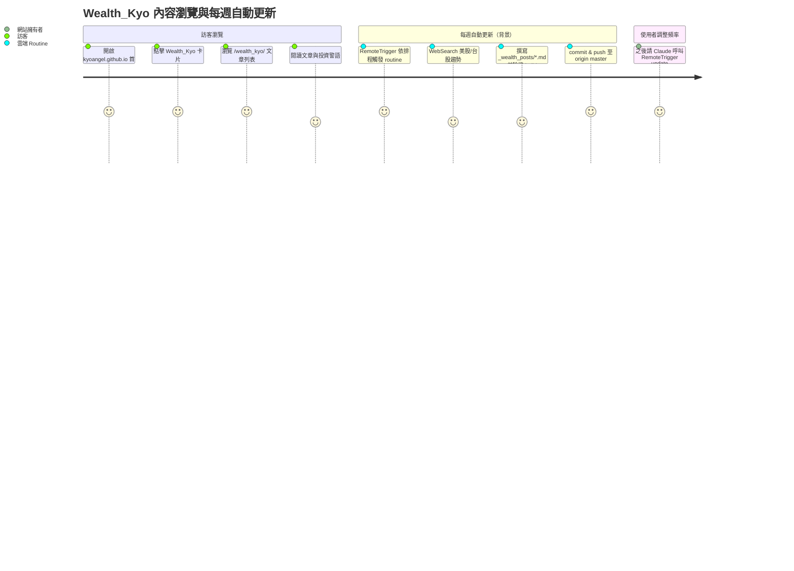

# Wealth_Kyo 第二專案 + 每週自動發文 Harness Implementation Plan

> **For Agent:** Execute this plan task-by-task. Follow each step exactly, verify build results before proceeding, and commit after each task.
> **TDD Rule:** 本計畫所有 Task 皆為 Jekyll 設定/版型/內容變更（純靜態站、無單元測試框架），已採用下方「Configuration-only exception」，以 `bundle exec jekyll build` + `_site/` 輸出檢查 + `jekyll serve`/curl 取代 RED/GREEN/REFACTOR。

**Goal:** 在現有 `kyoangel.github.io` repo 中新增「Wealth_Kyo」內容分區（`/wealth_kyo/`，美股/台股投資趨勢觀察），沿用 Mediumish 版型與 Hub 首頁卡片，並透過 Claude Code `/schedule`（RemoteTrigger 雲端 routine）每週自動研究趨勢、產出文章、驗證並推送，頻率之後可由使用者自行調整。

**Architecture:** 新增 Jekyll 自訂 collection `_wealth_posts/`（`permalink: /wealth_kyo/:title/`），沿用既有 `_layouts/post.html`/`postbox.html`（文章不帶 `categories:`/`tags:`，避開硬編碼的 `/coder_kyo/categories`、`/coder_kyo/tags` 連結與 jekyll-archives 限制）。`_layouts/default.html` 增加一個 `is_wealth_kyo` 分區旗標，做最小幅度的品牌/導覽調整。最後以獨立 Phase 透過 `RemoteTrigger` 建立每週排程 routine。

**Tech Stack:** Jekyll 4.3.4（github-pages gem）、Liquid、Mediumish 主題、Claude Code `RemoteTrigger`（`/schedule`）

**Complexity Path:** `Simplified TDD path`（純靜態站設定/版型/內容變更，無後端邏輯）

**Status:** 全部 Phase 完成並通過 dry-run。Phase 1-6 已 push 至 `origin master`；Phase 7 已建立並啟用每週 Routine（`trig_0158t4PLuUw1WKABm3JzKKbi`），使用者已完成 GitHub 連結與 Allow unrestricted branch pushes；dry-run 驗證內容產出 pipeline 成功，但 push 落在 `claude/*` 分支而非 `master`（已手動合併、並更新 prompt 改用 `git push origin HEAD:master`，待下次排程驗證），詳見 Phase 7「Dry-run 結果」

---

## Context

`docs/research.md` 第 3 節已確認：第二個專案採「同 repo 新分區 `/wealth_kyo/`」、主題為美股/台股投資趨勢觀察、沿用 Mediumish 視覺、透過 Claude Code `/schedule` 雲端 routine 每週自動產文，且頻率需可由使用者事後調整（不改 repo 程式碼）。

本次規劃過程中，透過直接閱讀 `_layouts/default.html`、`_layouts/post.html`、`_includes/postbox.html`、`coder_kyo/index.html`、`_config.yml`、既有 `_posts/*.md` 範例與 `CronCreate`/`RemoteTrigger` 工具定義，把 research.md 列出的技術限制逐一收斂為具體、低風險的實作方式：

1. **內容資料架構**：採用新 collection `_wealth_posts/`（research.md 建議方案）。
2. **`_layouts/post.html` 硬編碼分類/標籤連結（103/116 行）**：**不需修改**。`site.categories`/`site.tags`/jekyll-archives 只反映 `site.posts`（`_posts/`），只要 Wealth_Kyo 文章 front matter 不帶 `categories:`/`tags:`，`post.html` 裡的分類/標籤迴圈完全不會執行，硬編碼連結永不渲染。`_layouts/categories.html`、`_layouts/tags.html`、`_pages/{categories,tags}.md`、`jekyll-archives` 設定同樣**不需修改**——這比 research.md 原先評估的風險小很多。
3. **`_layouts/default.html` 才是真正需要分區感知化的地方**：Logo 連結、「Blog」導覽項目（含 active 判斷）、`<title>`/站名/站台說明文字（lines 10、72-74、89-99、118-125）目前全部硬編碼為 Coder_Kyo；另外「Categories Jumbotron」（lines 154-182）會在每一頁渲染、迭代全域 `site.categories`、連結指向 `/coder_kyo/categories#...`，若不處理會在 Wealth_Kyo 頁面顯示 Coder_Kyo 的分類清單。本計畫用單一 `is_wealth_kyo` 旗標做最小調整：Wealth_Kyo 頁面顯示自己的站名/說明、Logo/Blog 連回 `/wealth_kyo/`，並隱藏 Jumbotron（因 Wealth_Kyo 文章本來就沒有分類）。「About」導覽項目維持指向共用的 `/coder_kyo/about`（v1 不另建 Wealth_Kyo About 頁）。
4. **自訂 collection 的 `date`**：`_wealth_posts/*.md` 必須在 front matter 明確帶 `date:`（不會從檔名推導）。為避免 `:title` permalink 與「檔名是否含日期前綴」的不確定性，**檔名不含日期前綴**（例如 `ai-capex-tech-giants-and-taiwan-supply-chain.md`），日期完全由 front matter 提供——產出的網址會與 `/coder_kyo/:title/` 風格一致（不含日期）。
5. **`/schedule` 雲端 routine**：Claude Code 工具集中對應的是 `RemoteTrigger`（`claude.ai` 後端的排程 API：`list`/`get`/`create`/`update`/`run`）——這是真正的雲端 routine（與本機 session 無關，`update` 可改排程、`run` 可手動觸發 dry-run），完全符合「之後可調整頻率、不需改 repo 程式碼」的需求。push 權限取決於 `claude.ai` 帳號已連結的 GitHub 存取權限（與本機 SSH key 無關），需在建立後以 `RemoteTrigger run` 做一次 dry-run 驗證。

---

## Requirements

### User Stories
- As a 網站訪客，I want 在首頁 Hub 看到 Wealth_Kyo 卡片並點進去，so that 我可以閱讀美股/台股投資趨勢觀察文章。
- As a 網站擁有者（Kyo），I want Wealth_Kyo 文章每週自動產出、驗證並推送，so that 不需要手動維護就能保持內容更新。
- As a 網站擁有者（Kyo），I want 之後可以自行調整自動發文的頻率，so that 不需要再次修改 repo 程式碼或請人重新規劃。

### Acceptance Criteria
- Given 首頁 `/`，when 訪客瀏覽 Hub，then 看到一張 `status: active` 的 Wealth_Kyo 卡片，連到 `/wealth_kyo/`。
- Given `/wealth_kyo/`，when 訪客開啟頁面，then 看到 Mediumish 版型、Wealth_Kyo 站名/說明文字、Logo 與「Blog」導覽連回 `/wealth_kyo/`，且看到至少一篇文章卡片。
- Given `/wealth_kyo/<slug>/` 文章頁，when 訪客開啟，then 看到作者 `WAI`、日期、文章內容與投資警語區塊，且不出現分類/標籤連結。
- Given `/coder_kyo/` 與既有頁面，when 重新建置後比對，then 行為與輸出與調整前一致（除 `default.html` 內新增的 Liquid 條件外，不影響既有分支）。
- Given Wealth_Kyo 每週自動發文 routine 已建立，when 使用者要求調整頻率，then 透過對話呼叫 `RemoteTrigger update` 即可完成，不需改動 repo 程式碼。

### Assumptions, Constraints, and Scope Boundaries
- 不修改 `_layouts/post.html`、`_layouts/categories.html`、`_layouts/tags.html`、`_pages/categories.md`、`_pages/tags.md`、jekyll-archives 設定（理由見 Context #2）。
- `_layouts/default.html` 的 footer 版權文字（`{{ site.name }}`）與 `` 全站 meta 標籤，v1 維持共用（Coder_Kyo 名稱），不做分區化——僅為輔助 metadata，非主要導覽/品牌呈現，影響有限。
- 「About」導覽項目在 Wealth_Kyo 頁面仍指向 `/coder_kyo/about`（共用關於頁），v1 不新增 Wealth_Kyo 專屬 About 頁。
- Wealth_Kyo 作者 persona（`WAI`）不提供自訂 `avatar` 圖檔（無法產生新圖片資產），沿用 `postbox.html` 既有的 Gravatar fallback（顯示通用預設頭像），未來可自行在 `_config.yml` 補上 `avatar:`。
- `_wealth_posts/*.md` 一律不帶 `categories:`/`tags:`/`permalink:`，檔名不含日期前綴，`date:` 為必填 front matter。
- Phase 7（`/schedule`/`RemoteTrigger`）建立的是「每週自動對 `kyoangel/kyoangel.github.io` 進行 commit & push 的雲端 routine」——這是會持續產生真實 repo 變更的自動化，執行前請再次確認。

## Architecture Review

**可重用元件**
- `_includes/postbox.html`：只依賴 `post.url/title/excerpt/author/date/image/rating`，皆為選填（`image`/`rating` 用 `` 包裹），`author` 透過 `site.authors[post.author]` 查表，`avatar` 缺省時 fallback 到 Gravatar。`_wealth_posts` 文件可直接套用，零修改。
- `coder_kyo/index.html`：`wealth_kyo/index.html` 的直接範本（`layout: default` + `permalink:` + `postbox.html` 迴圈）。
- `_data/projects.yml` + `index.html`（Hub）：新增一筆 `status: active` 紀錄即可，HTML/CSS 零修改（`docs/plans/2026-06-12-new-homepage-hub.md` 已驗證此模式）。
- `_config.yml` `authors.KAI`：`WAI` persona 的欄位範本。

**受影響的層與資料流**
```
_config.yml (collections.wealth_posts, authors.WAI)
        |
        v
_wealth_posts/*.md  --(permalink: /wealth_kyo/:title/)-->  site.wealth_posts
        |                                                          |
        v                                                          v
_layouts/post.html (沿用，無 categories/tags 迴圈執行)      wealth_kyo/index.html (sort by date, postbox.html)
        |                                                          |
        +---------------------> _layouts/default.html <-----------+
                                  (is_wealth_kyo 分區旗標：
                                   title / 站名說明 / Logo / Blog 導覽 / 隱藏 Jumbotron)
                                          |
                                          v
                                  _data/projects.yml (Hub 卡片) --> index.html (Hub)
```

**Mermaid 使用者旅程**


**將變更/新增的檔案**
- Modify: `_config.yml`（新增 `collections.wealth_posts` + `authors.WAI`）
- Modify: `_layouts/default.html`（`is_wealth_kyo` 旗標 + 6 個分區感知調整點）
- Create: `wealth_kyo/index.html`
- Create: `_wealth_posts/ai-capex-tech-giants-and-taiwan-supply-chain.md`（種子文章）
- Modify: `_data/projects.yml`（取代一張 Coming Soon 佔位卡）
- （Phase 7，非 repo 檔案變更）建立 `RemoteTrigger` 每週 routine

---

## Implementation Steps

### Phase 1: 資料架構與作者設定

#### Task 1: 新增 `wealth_posts` collection 與 `WAI` 作者 persona
**Exception Type:** Configuration-only
**User Approval:** 與前兩個 plan（`2026-06-12-coder-kyo-routing-split.md`、`2026-06-12-new-homepage-hub.md`）相同，已採用 Configuration-only exception（純靜態 Jekyll 設定變更，無測試框架，以 `bundle exec jekyll build` 驗證）。
**Files:**
- Modify: `_config.yml`

**Implementation**

在 `permalink: /coder_kyo/:title/` 之後新增 collections 設定：

```yaml
permalink: /coder_kyo/:title/

# Collections
collections:
  wealth_posts:
    output: true
    permalink: /wealth_kyo/:title/
```

在 `authors:` 區塊的 `KAI:` 之後新增 `WAI:`：

```yaml
  WAI:
    name: WAI
    display_name: WAI
    email: kyoangel.tw@gmail.com
    web: https://kyoangel.github.io
    instagram: https://www.instagram.com/coder_kyo
    description: "AI of Wealth_Kyo, sharing US/Taiwan stock market trend observations by AI generated content."
```

（`WAI` 不設定 `avatar`/`gravatar`，`postbox.html` 會 fallback 到 Gravatar 預設頭像，理由見 Assumptions。）

**Verification**
Run: `cd /Users/kyo.lai82/Projects/Personal/kyoangel.github.io && bundle exec jekyll build 2>&1`

Confirm:
- 無 error/warning（新 collection 目前無任何文件，Jekyll 對空 collection 應正常處理）
- `_config.yml` 可被 YAML 正確解析（build 不會因語法錯誤中斷）
- 既有 `_site/coder_kyo/` 輸出不受影響

**COMMIT**
Run:
`git add _config.yml && git commit -m "feat(wealth_kyo): add wealth_posts collection and WAI author persona"`

---

### Phase 2: `_layouts/default.html` 分區感知化

#### Task 2: 新增 `is_wealth_kyo` 旗標並調整品牌/導覽/Jumbotron
**Exception Type:** Configuration-only
**User Approval:** 同 Task 1。
**Files:**
- Modify: `_layouts/default.html`

**Implementation**

1) 在檔案最開頭（`<!DOCTYPE html>` 之前）新增旗標，使用 `` trim 避免產生多餘空白行：

```liquid




<!DOCTYPE html>
```

2) `<title>`（原第 10 行）：

```liquid

    <title>{{ page.title }} | Wealth_Kyo</title>

    <title>{{ page.title }} | {{site.name}}</title>

```

3) Logo（原第 72-74 行）：

```liquid

            <a class="navbar-brand" href="{{ site.baseurl }}/wealth_kyo/" data-name="nav-brand">
                
            </a>

            <a class="navbar-brand" href="{{ site.baseurl }}/coder_kyo/" data-name="nav-brand">
                
            </a>

```

4) 「Blog」導覽項目 + active 判斷（原第 89-95 行）：

```liquid

                    
                    <li class="nav-item active">
                        
                    <li class="nav-item">
                        
                        <a class="nav-link" href="{{ site.baseurl }}/wealth_kyo/">Blog</a>
                    </li>

                    
                    <li class="nav-item active">
                        
                    <li class="nav-item">
                        
                        <a class="nav-link" href="{{ site.baseurl }}/coder_kyo/">Blog</a>
                    </li>

```

（「About」項目，原第 97-99 行，維持不變——兩個分區共用 `/coder_kyo/about`。）

5) 站台標題/說明文字（原第 120-125 行）：

```liquid

            <div class="mainheading">
                <h1 class="sitetitle">Wealth_Kyo</h1>
                <p class="lead">
                    美股、台股投資趨勢觀察與市場筆記
                </p>
            </div>

            <div class="mainheading">
                <h1 class="sitetitle">{{ site.name }}</h1>
                <p class="lead">
                    {{ site.description }}
                </p>
            </div>

```

6) Categories Jumbotron（原第 154-182 行）：將整個 `<div class="jumbotron fortags" ...> ... </div>` 區塊包入：

```liquid

        <!-- Categories Jumbotron
================================================== -->
        <div class="jumbotron fortags" data-name="jumbotron">
            ...（內容不變）...
        </div>

```

**Verification**
Run: `cd /Users/kyo.lai82/Projects/Personal/kyoangel.github.io && bundle exec jekyll build 2>&1`

Confirm:
- 無 error/warning
- `_site/coder_kyo/index.html` 仍含 `Coder_Kyo`（站名）、`href="/coder_kyo/"` 的 Logo/Blog 連結、且仍含 `jumbotron fortags`（`grep -E "Coder_Kyo|coder_kyo/|jumbotron fortags" _site/coder_kyo/index.html`）
- （`/wealth_kyo/` 分支會在 Task 3 建立索引頁後一併驗證）

**COMMIT**
Run:
`git add _layouts/default.html && git commit -m "feat(wealth_kyo): make default layout section-aware for wealth_kyo pages"`

---

### Phase 3: Wealth_Kyo 索引頁

#### Task 3: 新增 `wealth_kyo/index.html`
**Exception Type:** Configuration-only
**User Approval:** 同 Task 1。
**Files:**
- Create: `wealth_kyo/index.html`

**Implementation**

```html
---
layout: default
title: Wealth_Kyo
permalink: /wealth_kyo/
---

<!-- Posts Index
================================================== -->
<section class="recent-posts">

    <div class="section-title">

        <h2><span>All Stories</span></h2>

    </div>

    <div class="row listrecent">

        

        

        

        

    </div>

</section>
```

**Verification**
Run: `cd /Users/kyo.lai82/Projects/Personal/kyoangel.github.io && bundle exec jekyll build 2>&1`

Confirm:
- 無 error/warning
- `_site/wealth_kyo/index.html` 已產生
- `grep -E "Wealth_Kyo|美股、台股投資趨勢觀察與市場筆記|wealth_kyo/" _site/wealth_kyo/index.html` 命中 `is_wealth_kyo` 分支的站名/說明/Logo/Blog 連結
- `grep "jumbotron fortags" _site/wealth_kyo/index.html` 無結果（Jumbotron 已隱藏）
- （此時 `site.wealth_posts` 仍為空，`listrecent` 區塊內無卡片——將在 Task 4 後再次確認）

**COMMIT**
Run:
`git add wealth_kyo/index.html && git commit -m "feat(wealth_kyo): add wealth_kyo index page"`

---

### Phase 4: 種子文章

#### Task 4: 新增第一篇 Wealth_Kyo 文章（種子文章 + 範本）
**Exception Type:** Generated code
**User Approval:** 與 `generate_blog.py`/既有 `_posts/*.md` AI 撰文慣例相同性質，已採用 Generated code exception——此檔案內容由 AI 撰寫，作為驗證與後續 `/schedule` routine 的範本。
**Files:**
- Create: `_wealth_posts/ai-capex-tech-giants-and-taiwan-supply-chain.md`

**Implementation**

```markdown
---
layout: post
title: "AI 資本支出熱潮下：美股科技巨頭與台股供應鏈的投資趨勢觀察"
author: WAI
date: 2026-06-13 09:00:00 +0800
---

2026 年以來，人工智慧（AI）基礎設施的建置熱潮，持續成為全球資本市場最受矚目的主題之一。從美股市值最大的幾家科技公司，到台股供應鏈中的半導體與伺服器製造廠，AI 相關的資本支出（Capex）動向，幾乎牽動著整個科技產業的投資情緒。

## 美股觀察：資本支出與營收成長的賽跑

過去幾個季度，市場上常聽到「七大科技巨頭」（Magnificent Seven）這個說法——泛指那些在雲端運算、晶片設計、消費電子與 AI 模型開發上居於領先地位的美股大型企業。這些公司近年來的財報中，一個共同的趨勢是：用於資料中心、AI 伺服器與運算能力的資本支出比例持續攀升。

這樣的趨勢帶來兩種解讀。樂觀的一方認為，這是企業為下一輪成長週期提前佈局，AI 應用一旦普及，將帶來顯著的營收與利潤貢獻。謹慎的一方則提出疑問：當資本支出成長速度長期超過營收成長速度，投資人該如何評估這些支出的「投資回報率」（ROI），以及目前的股價評價（valuation）是否已經提前反映了樂觀預期。

對長期關注美股科技股的投資人來說，與其只看單一季度的財報數字，更值得留意的，或許是企業管理層在法說會上對於「資本支出指引」與「需求能見度」的說法是否一致、是否持續，以及這些支出最終轉化為實際營收的時間軸。

## 台股連結：半導體與伺服器供應鏈的角色

這股 AI 基礎建設浪潮，對台灣的科技供應鏈而言，同樣具有重要意義。從晶圓代工、先進封裝，到伺服器機殼、電源管理、散熱模組等次系統供應商，台灣在全球 AI 硬體供應鏈中，長期扮演著不可或缺的角色。

當美股科技巨頭持續加碼資本支出，市場往往會將目光轉向台灣供應鏈廠商的訂單動能、產能利用率，以及未來幾個季度的營收展望，作為驗證「AI 需求是否真實存在」的重要指標之一。換句話說，美股的資本支出趨勢與台股供應鏈的營運數據，某種程度上形成了一組互相印證的觀察指標。

## 投資人可以關注的幾個面向

對於有興趣追蹤這個主題的投資人，以下幾個方向可能值得長期觀察：

1. **資本支出與營收的對應關係**：留意大型科技公司財報中，資本支出增幅與雲端/AI 業務營收增幅之間的差距是否逐漸收斂。
2. **供應鏈訂單能見度**：台灣相關供應商在法說會中，對於未來季度訂單與產能規劃的描述，是否與終端需求趨勢一致。
3. **評價水準的相對位置**：將目前的本益比、企業價值倍數等指標，與該公司或產業過去數年的歷史區間做比較，了解目前評價是處於相對高位或低位。
4. **資產配置與分散風險**：無論對單一主題或產業多麼看好，適度的資產配置與分散投資，仍是降低波動風險的基本原則。

## 結語

AI 資本支出熱潮，短期內仍可能是美股與台股科技類股的核心敘事之一。但市場敘事與企業基本面之間，往往存在時間差與不確定性。持續關注財報數字、供應鏈動態與評價水準的變化，比追逐單一新聞標題更能幫助投資人建立自己的判斷框架。

---

**警語：本文由 AI 自動生成，僅為市場資訊整理與個人觀察，不構成任何投資建議，投資前請自行評估風險並諮詢專業意見。**
```

**Verification**
Run: `cd /Users/kyo.lai82/Projects/Personal/kyoangel.github.io && bundle exec jekyll build 2>&1`

Confirm:
- 無 error/warning
- `_site/wealth_kyo/ai-capex-tech-giants-and-taiwan-supply-chain/index.html` 已產生
- `_site/wealth_kyo/index.html` 的 `listrecent` 區塊內出現該文章卡片（`grep "AI 資本支出熱潮下" _site/wealth_kyo/index.html`）
- 文章頁 `grep -E "WAI|警語" _site/wealth_kyo/ai-capex-tech-giants-and-taiwan-supply-chain/index.html` 兩者皆命中（作者顯示、警語顯示）
- `grep -E "coder_kyo/categories|coder_kyo/tags" _site/wealth_kyo/ai-capex-tech-giants-and-taiwan-supply-chain/index.html` 無結果（無 categories/tags，硬編碼連結未渲染）

**COMMIT**
Run:
`git add _wealth_posts/ai-capex-tech-giants-and-taiwan-supply-chain.md && git commit -m "feat(wealth_kyo): add seed post on AI capex trends"`

---

### Phase 5: 首頁 Hub 卡片

#### Task 5: 更新 `_data/projects.yml`，以 Wealth_Kyo 取代一張 Coming Soon 佔位卡
**Exception Type:** Configuration-only
**User Approval:** 同 Task 1。
**Files:**
- Modify: `_data/projects.yml`

**Implementation**

將第一張 `Coming Soon` 佔位卡取代為：

```yaml
- title: "Coder_Kyo Blog"
  description: "分享程式開發技巧、學習筆記與技術心得"
  url: /coder_kyo/
  status: active

- title: "Wealth_Kyo"
  description: "美股、台股投資趨勢觀察與市場筆記"
  url: /wealth_kyo/
  status: active

- title: "Coming Soon"
  description: "新專案籌備中，敬請期待"
  url: ""
  status: placeholder
```

**Verification**
Run: `cd /Users/kyo.lai82/Projects/Personal/kyoangel.github.io && bundle exec jekyll build 2>&1`

Confirm:
- 無 error/warning
- `_site/index.html` 含兩張 `project-card--active`（`grep -c "project-card--active" _site/index.html` = 2）且其中一張連到 `/wealth_kyo/`
- `_site/index.html` 仍含一張 `project-card--placeholder`

**COMMIT**
Run:
`git add _data/projects.yml && git commit -m "feat(home): add wealth_kyo card to project hub"`

---

### Phase 6: 全站建置驗證

#### Task 6: `bundle exec jekyll serve` 端到端檢查
**Exception Type:** Configuration-only
**User Approval:** 同 Task 1（與兩個前序 plan 的 Phase 6/「serve + curl」驗證模式一致）。
**Files:**
- (無檔案變更，純驗證)

**Implementation**

啟動本地伺服器並用 curl 檢查三個關鍵頁面：

```bash
cd /Users/kyo.lai82/Projects/Personal/kyoangel.github.io
bundle exec jekyll serve --detach
sleep 3
curl -s http://127.0.0.1:4000/ | grep -E "Wealth_Kyo|Coder_Kyo Blog"
curl -s http://127.0.0.1:4000/wealth_kyo/ | grep -E "Wealth_Kyo|美股、台股投資趨勢觀察"
curl -s http://127.0.0.1:4000/wealth_kyo/ai-capex-tech-giants-and-taiwan-supply-chain/ | grep -E "WAI|警語"
curl -s http://127.0.0.1:4000/coder_kyo/ | grep -E "Coder_Kyo|jumbotron fortags"
kill $(cat _site/../.jekyll-metadata 2>/dev/null) 2>/dev/null; pkill -f "jekyll serve" || true
```

**Verification**
Confirm:
- 首頁 `/` 同時含 `Wealth_Kyo` 與 `Coder_Kyo Blog` 兩張卡片文字
- `/wealth_kyo/` 回應含 Wealth_Kyo 站名與說明文字
- 種子文章頁回應含作者 `WAI` 與「警語」
- `/coder_kyo/` 回應仍含 `Coder_Kyo` 站名與 `jumbotron fortags`（Jumbotron 未被誤隱藏）
- `bundle exec jekyll serve` 程序已停止（不留下背景行程）

**COMMIT**
（純驗證，無檔案變更，不需 commit）

---

### Phase 7: `/schedule` 雲端每週自動發文 routine（獨立 Phase，非 build 可驗證）

> 此 Phase 會建立一個會持續對 `kyoangel/kyoangel.github.io` 進行 commit & push 的雲端自動化。建議在 Phase 1-6 的程式碼變更皆已 push 上線後才執行本 Phase。

#### Task 7: 建立 RemoteTrigger 每週 routine 並完成 dry-run 驗證
**Exception Type:** Configuration-only（雲端設定，非 repo 內檔案）
**User Approval:** 對應使用者需求「透過 Claude Code /schedule 雲端 routine，每週自動更新，頻率之後需可調整」。
**Files:**
- (無 repo 內檔案變更)

**Implementation**

1) 呼叫 `RemoteTrigger`（`action: create`），排程為每週一次（預設每週一 09:00，可依工具回應的「server-parsed run time」確認時區後微調），prompt 內容如下（與 Task 4 的種子文章慣例一致）：

```text
你是 kyoangel.github.io repo 的週期性內容產出 routine（Wealth_Kyo 分區）。請依序完成：

1. 使用 WebSearch 搜尋過去 7 天內美股或台股市場的重要趨勢、產業動態或宏觀經濟主題（例如：科技股財報、AI 資本支出、半導體供應鏈、ETF 資金流向、利率政策對股市影響等），選定 1 個主題。

2. 在 `_wealth_posts/` 目錄下建立一個新檔案，檔名格式為 `<kebab-case-slug>.md`（不含日期前綴，使用英文 slug，避免與既有檔名重複）。front matter 格式如下：

---
layout: post
title: "<繁體中文標題>"
author: WAI
date: <今天日期 YYYY-MM-DD HH:MM:SS +0800>
---

3. 文章內容以繁體中文撰寫，500-800 字，風格為「市場趨勢觀察與個人解讀」（非即時報價、非具體買賣建議），可參考 `_wealth_posts/` 中既有文章的寫作風格與結構。

4. 文章結尾務必加上以下警語區塊（與既有文章格式一致）：

---

**警語：本文由 AI 自動生成，僅為市場資訊整理與個人觀察，不構成任何投資建議，投資前請自行評估風險並諮詢專業意見。**

5. 不要加入 `categories:`、`tags:`、`permalink:` 等 front matter 欄位。

6. 執行 `bundle exec jekyll build`，確認無錯誤；若有錯誤，修正後重新執行直到成功。

7. 將新檔案加入版本控制並 commit，訊息格式為 `feat(wealth_kyo): add weekly post on <主題關鍵字>`，然後 push 到 `origin master`。

8. 除了新增的 `_wealth_posts/*.md` 檔案，不要修改任何其他檔案。
```

建議的 cron：`0 9 * * 1`（每週一 09:00，**注意：經實測此欄位以 UTC 計算**，台北 09:00 應設為 `0 1 * * 1`）。

2) 取得 `RemoteTrigger create` 回應後，記錄回傳的 `trigger_id` 與 claude.ai routine 連結（回報給使用者）。

3) 以 `RemoteTrigger`（`action: run`, `trigger_id`）手動觸發一次 dry-run，確認：
   - routine 能成功 checkout `kyoangel/kyoangel.github.io`
   - 能成功新增 `_wealth_posts/*.md`、跑 `bundle exec jekyll build` 通過
   - 能成功 `git push` 到 `origin master`（驗證 claude.ai 帳號的 GitHub 連結權限涵蓋此 repo 的寫入權限）

**最終設定（2026-06-13，透過 `/schedule` skill 完成）**

`/schedule` skill 提供了 `RemoteTrigger create`/`update` 的正確 body schema（`job_config.ccr.session_context.sources`/`allowed_tools`/`model` + `job_config.ccr.events[].data.message.content` 作為 prompt），先前嘗試的欄位名稱（`prompt`/`message`/`messages`/`system_prompt`/`task`/`input`/`max_turns`、`session_request.worker`）皆非正確結構。已將原本的 trigger 更新為完整設定：

- **Routine**：`Wealth_Kyo Weekly Post`（`trig_0158t4PLuUw1WKABm3JzKKbi`），連結：https://claude.ai/code/routines/trig_0158t4PLuUw1WKABm3JzKKbi
- **Repo**：`https://github.com/kyoangel/kyoangel.github.io`
- **Prompt**：上方 Implementation 步驟 1) 的中文指令全文
- **Model**：`claude-sonnet-4-6`
- **Allowed tools**：`Bash`, `Read`, `Write`, `Edit`, `Glob`, `Grep`, `WebSearch`
- **Cron**：`0 1 * * 1`（UTC）= 每週一 09:00 Asia/Taipei，`next_run_at: 2026-06-15T01:03:58Z`
- **enabled**：`true`

**使用者待辦（2 項，已於 2026-06-13 完成）**

1. ✅ **GitHub 連結**：使用者已執行 `/web-setup`（`claude auth status` 確認 `loggedIn: true`，帳號 `kyoangel`）。
2. ✅ **Allow unrestricted branch pushes**：使用者已在該 routine 的編輯頁面為此 repo 開啟此設定（dry-run 回應中 `sources[0].git_repository.allow_unrestricted_git_push: true` 已確認）。

**Dry-run 結果（2026-06-13，`RemoteTrigger action: run`）**

- ✅ Pipeline 本身完全成功：WebSearch 選定主題「晶片股閃崩與升息疑慮」，產出 `_wealth_posts/ai-chip-selloff-and-rate-hike-concerns.md`（繁體中文、約 600 字、正確 front matter、結尾含警語），`bundle exec jekyll build` 通過，commit 訊息符合 `feat(wealth_kyo): add weekly post on <主題關鍵字>` 格式。
- ⚠️ **但 push 落在 `origin/claude/trusting-tesla-pphll9` 分支，而非 `master`**（即使 `allow_unrestricted_git_push: true`）。判斷是 CCR sandbox 預設將 session 簽出在 `claude/<session>-<suffix>` 分支、且未加 refspec 的 `git push` 會推到同名遠端分支，與「unrestricted push」設定（決定能否推、而非預設推到哪）無關。
- ✅ **已手動修復**：將 `origin/claude/trusting-tesla-pphll9`（fast-forward）合併推送至 `master`（`b9a0cd2..cd81c45`），本機 `bundle exec jekyll build` 重新驗證通過，新文章已上線於 `/wealth_kyo/ai-chip-selloff-and-rate-hike-concerns/`。
- ✅ **已更新 routine prompt 步驟 7**：明確指示執行 `git push origin HEAD:master`（明確 refspec，直接推送目前 commit 到 origin 的 `master`，不論本機分支名稱為何），取代原本含糊的「push 到 origin master」。已透過 `RemoteTrigger update` 套用，`next_run_at` 不變（`2026-06-15T01:03:58Z`）。

**Verification**
Confirm:
- ✅ `RemoteTrigger update` 回應包含合理的下次執行時間（`next_run_at: 2026-06-15T01:03:58Z`）與 routine URL
- ✅ dry-run 已執行，內容產出 pipeline（WebSearch → 撰文 → build）驗證通過
- ⏳ **`git push origin HEAD:master` 的修正尚未經過真實 routine 執行驗證**——將於下次排程執行（2026-06-15 週一 09:00 Taipei）或下一次手動 `RemoteTrigger run` 時確認是否直接 push 到 `master`（而非再產生 `claude/*` 分支）。若仍落在 `claude/*` 分支，可能需改為「PR-based」工作流（routine 開 PR，使用者review 後合併）。

**頻率調整方式（之後隨時可做，不需改 repo）**
- 之後想調整頻率（例如改成每兩週、每月、或改成每週三），只需在任何一次對話中請 Claude 呼叫 `RemoteTrigger`（`action: update`, `trigger_id: trig_0158t4PLuUw1WKABm3JzKKbi`, `body: {"cron_expression": "<新 cron，UTC>"}`），或在 `claude.ai/code/routines` 該 routine 詳細頁面直接編輯排程，repo 程式碼與設定完全不需變動。
- 想暫停：`RemoteTrigger update` 設定 `{"enabled": false}`。想移除：至 `claude.ai/code/routines` 該 routine 頁面刪除（`RemoteTrigger` API 無 delete action）。

**COMMIT**
（本 Task 不修改 repo 檔案；dry-run 產生的 commit 由 routine 自動建立，無需手動 commit。）

---

## Testing Strategy
- **Build 驗證**：每個 Task 後執行 `bundle exec jekyll build`，確認無 error/warning，並用 `grep`/`test` 檢查 `_site/` 輸出內容是否符合預期（Configuration-only exception，比照前兩個 plan）。
- **端到端瀏覽驗證**：Task 6 透過 `bundle exec jekyll serve` + `curl` 檢查首頁、`/wealth_kyo/`、種子文章、`/coder_kyo/` 四個關鍵頁面。
- **自動化 routine 驗證**：Task 7 透過 `RemoteTrigger run` 進行一次完整 dry-run（WebSearch → 寫文章 → build → push），確認整條 pipeline 可運作。

## Risks & Mitigations
- **Risk**：自訂 collection 文件若缺少 `date:` front matter，排序/顯示可能異常 -> Mitigation：Task 4 種子文章與 Task 7 routine prompt 都明確要求 `date:` 為必填欄位；`wealth_kyo/index.html` 用 `sort: 'date' | reverse` 明確排序，不依賴檔案系統順序。
- **Risk**：`page.url contains "/wealth_kyo/"` 判斷未來若有 `/coder_kyo/xxx-wealth_kyo-xxx/` 之類巧合路徑，可能誤判 -> Mitigation：目前唯一以 `/wealth_kyo/` 開頭的路徑即為本分區，風險極低；若未來新增類似命名，再改用更嚴格的 `page.collection == "wealth_posts"` 或 `page.url starts_with` 判斷。
- **Risk**：Task 2 隱藏 Categories Jumbotron 後，Wealth_Kyo 頁面少了一個站內導覽區塊 -> Mitigation：v1 Wealth_Kyo 文章本來就沒有分類資料，顯示 Coder_Kyo 分類反而造成混淆；若未來 Wealth_Kyo 想要自己的分類導覽，可再規劃獨立的 Wealth_Kyo 專屬 Jumbotron/分類頁。
- **Risk**：`RemoteTrigger`（`/schedule`）的 push 權限取決於 claude.ai 帳號的 GitHub 連結設定，而非本機 SSH key -> Mitigation：Task 7 明確要求建立後立即做一次 `RemoteTrigger run` dry-run，若 push 失敗則屬於帳號層級設定問題，已在 Verification 中說明排查方向。
- **Risk**：`RemoteTrigger create`/`update` 的精確 body 結構未知（schema 為 `additionalProperties: {}`）-> Mitigation：Task 7 執行時以 prompt + cron 為主要欄位呼叫，依工具回應（含 server-parsed 時間與 routine URL）的回饋逐步補齊欄位；此為執行期即時調整，不影響其他 Phase。

## Success Criteria
- [x] `/` 首頁 Hub 顯示 Wealth_Kyo 卡片（`status: active`），連到 `/wealth_kyo/`
- [x] `/wealth_kyo/` 顯示 Mediumish 版型、Wealth_Kyo 站名/說明文字、Logo 與 Blog 導覽連回 `/wealth_kyo/`，且列出種子文章
- [x] `/wealth_kyo/ai-capex-tech-giants-and-taiwan-supply-chain/` 顯示作者 WAI、日期、內容與投資警語，且無分類/標籤連結
- [x] `/coder_kyo/` 與既有頁面行為/輸出不受影響（站名、Jumbotron、導覽連結皆維持原樣）
- [x] `bundle exec jekyll build` 全程無 error/warning
- [ ] 每週 Routine 建立成功，dry-run 確認可寫入 `_wealth_posts/*.md`、通過 build 驗證、並成功 push 到 `kyoangel/kyoangel.github.io`（**交接給使用者**：`RemoteTrigger`/`/v1/code/triggers` 非官方 Routines 建立路徑，需使用者透過 `claude.ai/code/routines` 網頁或 CLI `/schedule` 自行建立，步驟已寫在上方「Phase 7 交接步驟」）
- [x] 使用者已知曉：之後可在該 Routine 的詳細頁面直接編輯排程調整發文頻率，不需修改 repo 程式碼
